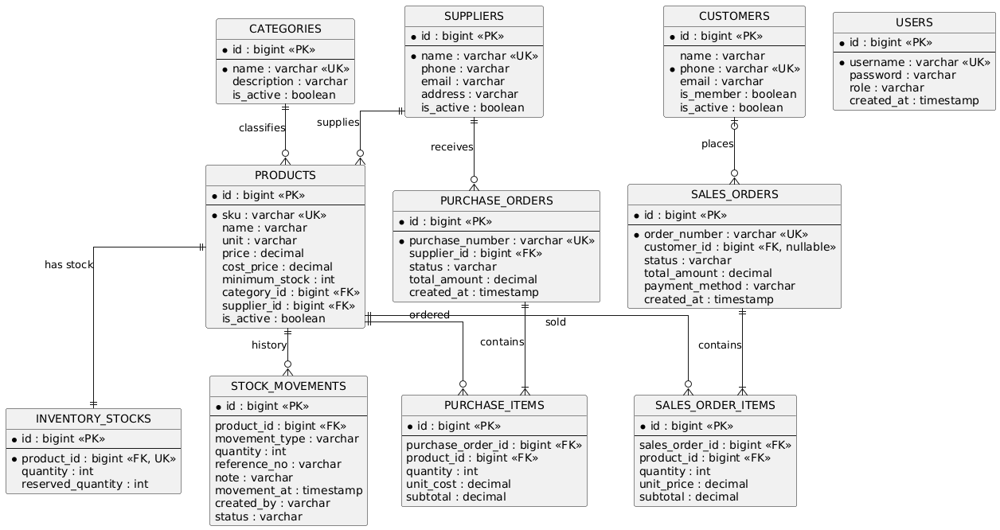

# Hardware Store Inventory Management System

ระบบจัดการคลังสินค้าของร้านอุปกรณ์การช่าง พัฒนาด้วย **Spring Boot (Backend)** และ **React (Frontend)**
รองรับการจัดการสินค้า หมวดหมู่ ผู้จำหน่าย ลูกค้า สต็อก การจัดซื้อ และคำสั่งขายผ่าน REST API
ใช้ PostgreSQL สำหรับ production และ H2 สำหรับการพัฒนาและทดสอบ พร้อมยืนยันตัวตนด้วย JWT
โครงสร้าง Backend แบ่งเป็น Controller, Service, Repository, Domain, DTO และ Mapper ตาม Layered Architecture

โครงสร้างระบบออกแบบตามหลัก **Layered Architecture**, **SOLID Principles**, **Enterprise / Architectural Design Patterns** และ **Behavioral Design Patterns** เพื่อให้สอดคล้องกับข้อกำหนดของรายวิชา **CP353002 Principles of Software Design and Development**

---

## สมาชิกกลุ่ม

| ลำดับ | ชื่อ-นามสกุล               | รหัสนักศึกษา | Section | Branch                    | หน้าที่รับผิดชอบ                                               |
| ----- | -------------------------- | -----------: | ------: | ------------------------- | -------------------------------------------------------------- |
| 1     | นายพีรพล แก้วเจริญสันติสุข |  673380287-8 |      01 | `peerapol_673380287-8_01` | Backend Setup, Exception, Swagger, Category, Supplier, Product |
| 2     | นายพิสิษฐ์ ทรัพย์อุดมโชติ  |  673380285-2 |      01 | `phisit_673380285-2_01`   | Inventory, Stock Movement, Purchase                            |
| 3     | นายพีรพัฒน์ แท่นประยุทร    |  673380288-6 |      01 | `peerapat_673380288-6_01` | Customer, Sales Order, Design Patterns                         |

---

## ฟังก์ชันหลักของระบบ

### 1. การจัดการสินค้าและหมวดหมู่
* เพิ่ม แก้ไข ลบ และค้นหาข้อมูลสินค้า
* จัดการหมวดหมู่สินค้าและข้อมูลผู้จำหน่าย
* ค้นหาสินค้าด้วย SKU และชื่อสินค้า
* รองรับ Pagination และ Sorting

### 2. การจัดการคลังสินค้า (Inventory & Stock Movement)
* ตรวจสอบจำนวนสินค้าคงเหลือ ปรับปรุงจำนวนสินค้า
* ตรวจสอบสินค้าที่มีจำนวนต่ำกว่าจุดสั่งซื้อขั้นต่ำ (Low Stock)
* บันทึกการเคลื่อนไหวของสินค้า (รับเข้า `IN`, จ่ายออก `OUT`, ปรับยอด `ADJUSTMENT`)
* ดูประวัติการเคลื่อนไหวทั้งหมดหรือกรองตามสินค้า

### 3. การจัดซื้อสินค้า (Purchase Order)
* สร้างใบสั่งซื้อสินค้าและเพิ่มรายการสินค้า
* ยืนยันการรับสินค้าเพื่อเพิ่มจำนวนสินค้าเข้าสู่คลังโดยอัตโนมัติ (สร้าง Stock Movement `IN`)

### 4. การจัดการลูกค้าและการขายสินค้า (Sales Order)
* สร้าง Sales Order และตัดจำนวนสินค้าออกจากคลังโดยอัตโนมัติ (สร้าง Stock Movement `OUT`)
* ตรวจสอบจำนวนสินค้าก่อนขาย ป้องกันสินค้าติดลบ
* จัดการสถานะคำสั่งซื้อ (PENDING, CONFIRMED, SHIPPED, COMPLETED, CANCELLED)

### 5. ระบบรักษาความปลอดภัย (Security)
* มีระบบ Authentication และ Authorization ด้วย **Spring Security** และ **JWT (JSON Web Token)**

---

## Tech Stack

### Backend
* **Language:** Java 17
* **Framework:** Spring Boot 4.1.1
* **Security:** Spring Security & JWT (`jjwt`)
* **Database & ORM:** Spring Data JPA, Hibernate, H2 (Development/Testing), PostgreSQL (Production)
* **Tools/Libraries:** Maven, Lombok, MapStruct (Data Mapper)
* **API Docs:** Springdoc OpenAPI / Swagger UI

### Frontend
* **Library:** React 18
* **Routing:** React Router v6
* **HTTP Client:** Axios
* **UI Components/Feedback:** React Toastify
* **Build Tool:** Create React App (`react-scripts`)

### Deployment
* **Containerization:** Docker & Docker Compose
* **Platform:** รองรับ Cloud Deployment

---

## System Architecture

ระบบใช้ **Layered Architecture** โดยแบ่งความรับผิดชอบอย่างชัดเจนดังนี้

```text
Frontend (React)
    │
    │ HTTP / REST API (JSON)
    ▼
Controller (Spring Web)
    │
    ▼
Service Layer (Business Logic)
    │
    ▼
Repository (Spring Data JPA)
    │
    ▼
Database (H2 / PostgreSQL)
```

### โครงสร้างแต่ละ Layer ใน Backend

* **Controller Layer**: จัดการ HTTP Requests และ Responses
* **Service Layer**: จัดการ Business Logic หลักทั้งหมดของระบบ
* **Repository Layer**: จัดการติดต่อฐานข้อมูลผ่าน Spring Data JPA
* **Domain Layer**: Entity Models ( mapped ไปยังตารางฐานข้อมูล)
* **DTO Layer**: Data Transfer Objects รับ-ส่งข้อมูล
* **Mapper Layer**: ใช้ `MapStruct` เพื่อช่วยแมปข้อมูลระหว่าง Entity และ DTO อย่างปลอดภัย
* **Security Layer**: ตั้งค่า Spring Security, JWT Filter, Authentication

---

## Database Design (ER Diagram)

ระบบมีตารางหลักสำหรับสินค้า สต็อก การเคลื่อนไหว การขาย การจัดซื้อ ลูกค้า และผู้ใช้ รวมความสัมพันธ์ One-to-One และ One-to-Many



รายละเอียดตาราง, key, index, relationship, cascade และ fetch type อยู่ใน [Data Dictionary](doc/data-dictionary.md)

---

## Installation & Setup

### Requirements
* **Java 17** และ **Maven**
* **Node.js** และ **npm**
* **Docker** และ **Docker Compose** (หากต้องการรันผ่าน Container)
* **PostgreSQL** (สำหรับรัน Production mode)

### Backend (Development / H2)
ด้วยโหมดนี้ ระบบจะใช้ In-memory Database (H2) ซึ่งข้อมูลจะหายไปเมื่อปิดโปรแกรม เหมาะสำหรับการพัฒนา

```powershell
cd code/backend/hardware-store
.\mvnw.cmd spring-boot:run
```
* Backend รันอยู่ที่พอร์ต: `http://localhost:8080`
* Swagger UI (API Docs): `http://localhost:8080/swagger-ui.html`

### Frontend
```powershell
cd code/frontend
npm install
npm start
```
* Frontend รันอยู่ที่พอร์ต: `http://localhost:3000`
* กำหนด `REACT_APP_API_URL` ได้เมื่อต้องการชี้ไปยัง backend คนละ origin; ค่าเริ่มต้นคือ `http://localhost:8080`

### Docker Compose
Compose เริ่ม Backend ใน production profile และต้องเชื่อมต่อ PostgreSQL ที่เตรียมไว้แยกต่างหาก โดยกำหนดค่าต่อไปนี้ใน `.env` ที่ root:

```dotenv
DB_URL=jdbc:postgresql://<host>:5432/hardware_store
DB_USERNAME=<username>
DB_PASSWORD=<password>
```

จากนั้นรัน:

```powershell
docker compose up --build
```
Backend จะให้บริการที่ `http://localhost:8080`

---

## API Documentation

* Swagger UI: `http://localhost:8080/swagger-ui.html`
* OpenAPI JSON: `http://localhost:8080/v3/api-docs`
* API endpoint, authentication, validation และ response: [API Documentation](doc/api-documentation.md)

---

## How to Run Tests
ระบบมีการทดสอบด้วย JUnit 5 และ Mockito

```powershell
cd code/backend/hardware-store
.\mvnw.cmd test
```

Maven Surefire สร้างรายงานต่อ test class ไว้ที่ `code/backend/hardware-store/target/surefire-reports/` หลังรันทดสอบ

การทดสอบครอบคลุมถึง:
* Unit Test, Service Test, Controller Test (MockMvc)
* Validation Test และ Exception Test
* Persistence/API Integration Test สำหรับการรับ Purchase และปรับปรุง Stock Movement
* State, Strategy, Validation Chain และ Low Stock Event

---

## Design Patterns & SOLID Principles

ระบบใช้ Enterprise patterns และ Behavioral GoF patterns ที่ระบุพร้อมเหตุผลและ class diagrams ใน [Design Patterns](doc/design-patterns.md) ส่วนการวิเคราะห์หลักการทั้งห้าข้อพร้อมตำแหน่งในโค้ดอยู่ใน [SOLID Analysis](doc/solid-analysis.md)

---

## เอกสารเพิ่มเติม (Documentation)

เอกสารและ diagram สำหรับการตรวจตามใบงาน:
* [Assignment Brief](doc/assignment.md)
* [API Documentation](doc/api-documentation.md)
* [Data Dictionary](doc/data-dictionary.md)
* [Design Patterns](doc/design-patterns.md)
* [SOLID Analysis](doc/solid-analysis.md)
* [Diagram Index](doc/diagrams/README.md)

---

## Deployment URL

https://frontendhardwarestore-production.up.railway.app/login

---

## Project Structure

```text
code/        Backend Spring Boot และ React frontend
test/        คู่มือรันชุดทดสอบและตำแหน่งรายงาน
doc/         API, Data Dictionary, SOLID, Design Patterns และ diagrams
img/         สื่อประกอบโครงการ
```
