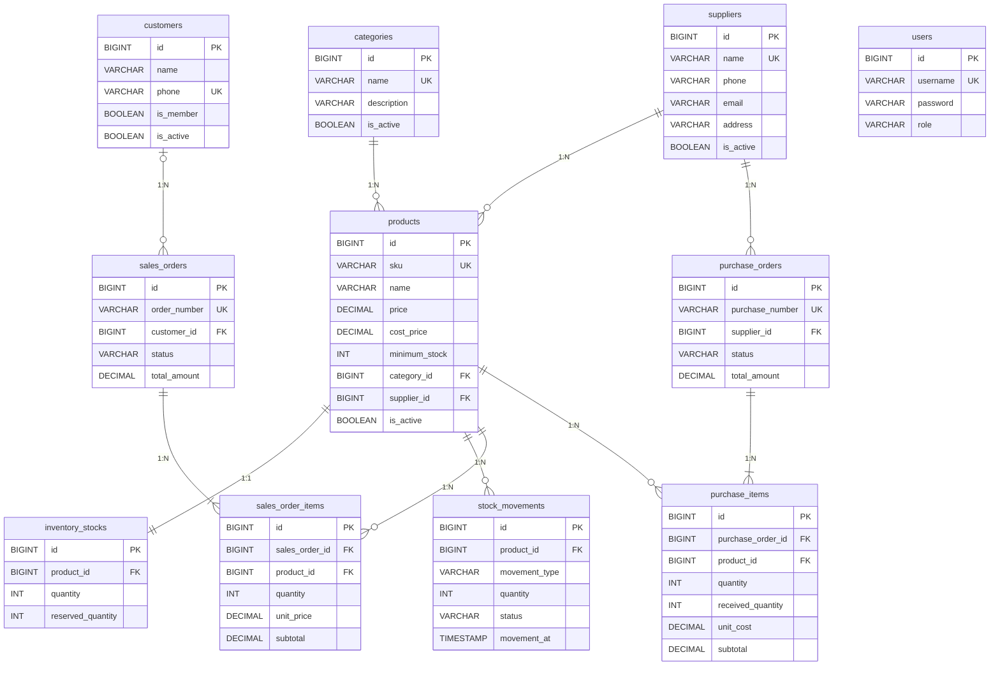

# Data Dictionary — Hardware Store Inventory Management System

อ้างอิงจาก `code/backend/hardware-store/src/main/resources/schema.sql` และ entity ใน `src/main/java/com/hardwarestore/domain/entity/`

คำย่อ: **PK** primary key · **FK** foreign key · **UK** unique · **NN** not null

## 1. ER Diagram

ตาราง `users` ไม่มีความสัมพันธ์กับตารางอื่น (ใช้สำหรับ login)

## 2. Tables

### 2.1 `categories` — หมวดหมู่สินค้า (Entity: `Category`)

| Column | Type | Constraint | Default | คำอธิบาย |
|---|---|---|---|---|
| `id` | BIGINT | PK, auto-increment | | รหัสหมวดหมู่ |
| `name` | VARCHAR(100) | NN, UK | | ชื่อหมวดหมู่ |
| `description` | VARCHAR(255) | | | คำอธิบาย |
| `is_active` | BOOLEAN | NN | TRUE | `FALSE` = ถูกลบแบบ soft delete |

### 2.2 `suppliers` — ซัพพลายเออร์ (Entity: `Supplier`)

| Column | Type | Constraint | Default | คำอธิบาย |
|---|---|---|---|---|
| `id` | BIGINT | PK, auto-increment | | รหัสซัพพลายเออร์ |
| `name` | VARCHAR(150) | NN, UK | | ชื่อ |
| `phone` | VARCHAR(20) | | | เบอร์โทร |
| `email` | VARCHAR(150) | | | อีเมล |
| `address` | VARCHAR(500) | | | ที่อยู่ |
| `is_active` | BOOLEAN | NN | TRUE | soft delete |

### 2.3 `products` — สินค้า (Entity: `Product`)

| Column | Type | Constraint | Default | คำอธิบาย |
|---|---|---|---|---|
| `id` | BIGINT | PK, auto-increment | | รหัสสินค้า |
| `sku` | VARCHAR(50) | NN, UK | | รหัส SKU |
| `name` | VARCHAR(150) | NN | | ชื่อสินค้า |
| `description` | VARCHAR(1000) | | | รายละเอียด |
| `unit` | VARCHAR(50) | | | หน่วยนับ |
| `price` | DECIMAL(19,2) | NN | | ราคาขาย (ใช้เป็น `unit_price` ของรายการขาย) |
| `cost_price` | DECIMAL(19,2) | NN | | ราคาต้นทุน (เห็นเฉพาะ `ProductAdminResponse`) |
| `minimum_stock` | INT | NN | 0 | จุดแจ้งเตือนสต็อกต่ำ |
| `category_id` | BIGINT | NN, FK → `categories.id` | | `fk_product_category` |
| `supplier_id` | BIGINT | NN, FK → `suppliers.id` | | `fk_product_supplier` |
| `is_active` | BOOLEAN | NN | TRUE | soft delete |

Index: `idx_product_sku (sku)`, `idx_product_name (name)`

### 2.4 `inventory_stocks` — ยอดสต็อกปัจจุบัน (Entity: `InventoryStock`)

| Column | Type | Constraint | Default | คำอธิบาย |
|---|---|---|---|---|
| `id` | BIGINT | PK, auto-increment | | |
| `product_id` | BIGINT | NN, UK, FK → `products.id` | | 1 สินค้ามีได้ 1 แถว (`fk_stock_product`) |
| `quantity` | INT | NN | 0 | จำนวนในคลังทั้งหมด |
| `reserved_quantity` | INT | NN | 0 | จำนวนที่จองไว้ |

ค่าที่คำนวณ (ไม่เก็บใน DB): `availableQuantity = quantity - reserved_quantity` (`InventoryStock.java:31-33`)

### 2.5 `stock_movements` — ประวัติความเคลื่อนไหวสต็อก (Entity: `StockMovement`)

| Column | Type | Constraint | Default | คำอธิบาย |
|---|---|---|---|---|
| `id` | BIGINT | PK, auto-increment | | |
| `product_id` | BIGINT | NN, FK → `products.id` | | `fk_movement_product` |
| `movement_type` | VARCHAR(20) | NN | | `IN` / `OUT` / `ADJUSTMENT` |
| `quantity` | INT | NN | | จำนวน (`ADJUSTMENT` = ยอดสต็อกใหม่ ไม่ใช่ส่วนต่าง) |
| `reference_no` | VARCHAR(100) | | | เลขอ้างอิง เช่น เลขใบสั่งขาย/ใบสั่งซื้อ |
| `note` | VARCHAR(500) | | | หมายเหตุ |
| `movement_at` | TIMESTAMP | NN | | เวลาเกิดรายการ |
| `created_by` | VARCHAR(50) | | | ผู้สร้าง (audit) |
| `updated_by` | VARCHAR(50) | | | ผู้แก้ล่าสุด (audit) |
| `updated_at` | TIMESTAMP | | | เวลาแก้ล่าสุด (audit) |
| `status` | VARCHAR(20) | | `'APPROVED'` | `PENDING` / `APPROVED` / `REJECTED` |
| `approved_by` | VARCHAR(50) | | | ผู้อนุมัติ |

### 2.6 `customers` — ลูกค้า (Entity: `Customer`)

| Column | Type | Constraint | Default | คำอธิบาย |
|---|---|---|---|---|
| `id` | BIGINT | PK, auto-increment | | |
| `name` | VARCHAR(150) | NN | | ชื่อลูกค้า |
| `phone` | VARCHAR(20) | NN, UK | | เบอร์โทร |
| `email` | VARCHAR(150) | | | อีเมล |
| `address` | VARCHAR(500) | | | ที่อยู่ |
| `is_member` | BOOLEAN | NN | FALSE | เป็นสมาชิกหรือไม่ (ได้ `MemberDiscount`) |
| `created_at` | TIMESTAMP | NN | | วันที่สร้าง |
| `is_active` | BOOLEAN | NN | TRUE | soft delete |

Index: `idx_customer_phone (phone)`, `idx_customer_email (email)`

### 2.7 `sales_orders` — ใบสั่งขาย (Entity: `SalesOrder`)

| Column | Type | Constraint | Default | คำอธิบาย |
|---|---|---|---|---|
| `id` | BIGINT | PK, auto-increment | | |
| `order_number` | VARCHAR(50) | NN, UK | | เลขที่ใบสั่งขาย รูปแบบ `SO-<UUID>` |
| `customer_id` | BIGINT | FK → `customers.id` (nullable) | | `NULL` = ไม่ระบุลูกค้า (`fk_so_customer`) |
| `status` | VARCHAR(20) | NN | | `PENDING` / `CONFIRMED` / `SHIPPED` / `COMPLETED` / `CANCELLED` |
| `total_amount` | DECIMAL(19,2) | NN | | ยอดรวมหลังคิดส่วนลด |
| `shipping_address` | VARCHAR(500) | | | ที่อยู่จัดส่ง |
| `payment_method` | VARCHAR(50) | | | วิธีชำระเงิน |
| `created_at` | TIMESTAMP | NN | | (audit) |
| `created_by` | VARCHAR(50) | | | (audit) |
| `updated_by` | VARCHAR(50) | | | (audit) |
| `updated_at` | TIMESTAMP | | | (audit) |

Index: `idx_sales_order_number (order_number)`

### 2.8 `sales_order_items` — รายการสินค้าในใบสั่งขาย (Entity: `SalesOrderItems`)

| Column | Type | Constraint | คำอธิบาย |
|---|---|---|---|
| `id` | BIGINT | PK, auto-increment | |
| `sales_order_id` | BIGINT | NN, FK → `sales_orders.id` | `fk_soi_so` |
| `product_id` | BIGINT | NN, FK → `products.id` | `fk_soi_product` |
| `quantity` | INT | NN | จำนวน |
| `unit_price` | DECIMAL(19,2) | NN | ราคา ณ เวลาที่ขาย (คัดลอกจาก `products.price` ฝั่งเซิร์ฟเวอร์) |
| `subtotal` | DECIMAL(19,2) | NN | ยอดของรายการหลังคิดส่วนลด |

### 2.9 `purchase_orders` — ใบสั่งซื้อจากซัพพลายเออร์ (Entity: `PurchaseOrder`)

| Column | Type | Constraint | Default | คำอธิบาย |
|---|---|---|---|---|
| `id` | BIGINT | PK, auto-increment | | |
| `purchase_number` | VARCHAR(50) | NN, UK | | เลขที่ใบสั่งซื้อ รูปแบบ `PO-<UUID>` |
| `supplier_id` | BIGINT | NN, FK → `suppliers.id` | | `fk_po_supplier` |
| `status` | VARCHAR(20) | NN | | `PENDING` / `APPROVED` / `PARTIAL` / `COMPLETED` |
| `total_amount` | DECIMAL(19,2) | NN | | ผลรวม `subtotal` ของทุกรายการ |
| `created_at` | TIMESTAMP | NN | | (audit) |
| `created_by` / `updated_by` | VARCHAR(50) | | | (audit) |
| `updated_at` | TIMESTAMP | | | (audit) |

Index: `idx_purchase_order_number (purchase_number)`

### 2.10 `purchase_items` — รายการสินค้าในใบสั่งซื้อ (Entity: `PurchaseItem`)

| Column | Type | Constraint | Default | คำอธิบาย |
|---|---|---|---|---|
| `id` | BIGINT | PK, auto-increment | | |
| `purchase_order_id` | BIGINT | NN, FK → `purchase_orders.id` | | `fk_pi_po` |
| `product_id` | BIGINT | NN, FK → `products.id` | | `fk_pi_product` |
| `quantity` | INT | NN | | จำนวนที่สั่ง |
| `received_quantity` | INT | NN | 0 | จำนวนที่รับแล้ว |
| `unit_cost` | DECIMAL(19,2) | NN | | ต้นทุนต่อหน่วย |
| `subtotal` | DECIMAL(19,2) | NN | | `unit_cost × quantity` |

### 2.11 `users` — ผู้ใช้ระบบ (Entity: `User`)

| Column | Type | Constraint | คำอธิบาย |
|---|---|---|---|
| `id` | BIGINT | PK, auto-increment | |
| `username` | VARCHAR(50) | NN, UK | ชื่อผู้ใช้สำหรับ login |
| `password` | VARCHAR(100) | NN | รหัสผ่านเข้ารหัส BCrypt |
| `name` | VARCHAR(150) | | ชื่อ-นามสกุล |
| `role` | VARCHAR(50) | NN | `CASHIER` / `STOCK_MANAGER` / `OWNER` |
| `created_at` | TIMESTAMP | NN | วันที่สร้าง |

## 3. Enumerations

เก็บเป็นข้อความด้วย `@Enumerated(EnumType.STRING)`

| Enum | ใช้ใน | ค่า |
|---|---|---|
| `Role` | `users.role` | `CASHIER`, `STOCK_MANAGER`, `OWNER` |
| `SalesOrderStatus` | `sales_orders.status` | `PENDING`, `CONFIRMED`, `SHIPPED`, `COMPLETED`, `CANCELLED` |
| `PurchaseOrderStatus` | `purchase_orders.status` | `PENDING`, `APPROVED`, `PARTIAL`, `COMPLETED` |
| `StockMovementType` | `stock_movements.movement_type` | `IN` (รับเข้า), `OUT` (จ่ายออก), `ADJUSTMENT` (ปรับยอดเป็นค่าที่กำหนด) |
| `StockMovementStatus` | `stock_movements.status` | `PENDING`, `APPROVED`, `REJECTED` |

## 4. Relationships, Cascade และ Fetch

| ความสัมพันธ์ | ชนิด | Fetch / Cascade |
|---|---|---|
| `categories` 1 — N `products` | Many-to-One จาก `Product` | LAZY |
| `suppliers` 1 — N `products` | Many-to-One จาก `Product` | LAZY |
| `products` 1 — 1 `inventory_stocks` | One-to-One จาก `InventoryStock` (`product_id` เป็น UK) | LAZY |
| `products` 1 — N `stock_movements` | Many-to-One จาก `StockMovement` | LAZY |
| `customers` 1 — N `sales_orders` | One-to-Many จาก `Customer` (`mappedBy = "customer"`) | LAZY, ไม่ cascade (ใบสั่งขายมีอายุเป็นของตัวเอง) |
| `sales_orders` 1 — N `sales_order_items` | One-to-Many จาก `SalesOrder` | `cascade = ALL`, `orphanRemoval = true` (รายการไม่มีความหมายถ้าไม่มีใบสั่งขาย) |
| `suppliers` 1 — N `purchase_orders` | Many-to-One จาก `PurchaseOrder` | LAZY |
| `purchase_orders` 1 — N `purchase_items` | One-to-Many จาก `PurchaseOrder` | `cascade = ALL`, `orphanRemoval = true` |

**Soft delete:** `products`, `customers`, `suppliers`, `categories` ใช้ `@SQLDelete` + `@SQLRestriction("is_active = true")` การลบคือ `UPDATE … SET is_active = false` และ query ปกติจะไม่เห็นแถวที่ถูกลบ

**Audit:** `sales_orders`, `purchase_orders`, `stock_movements`, `customers`, `users` ใช้ `AuditingEntityListener`
