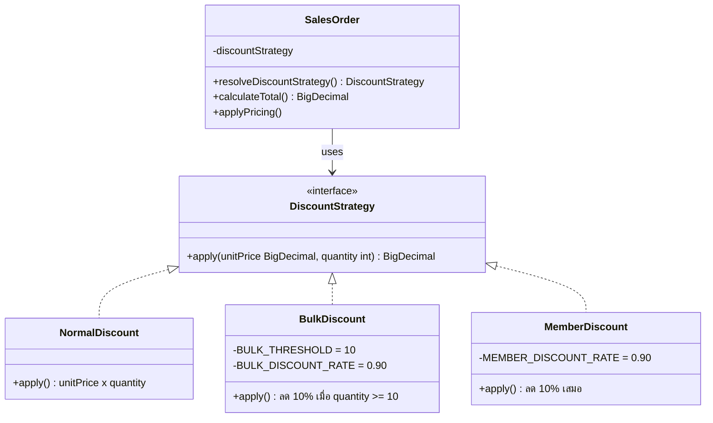
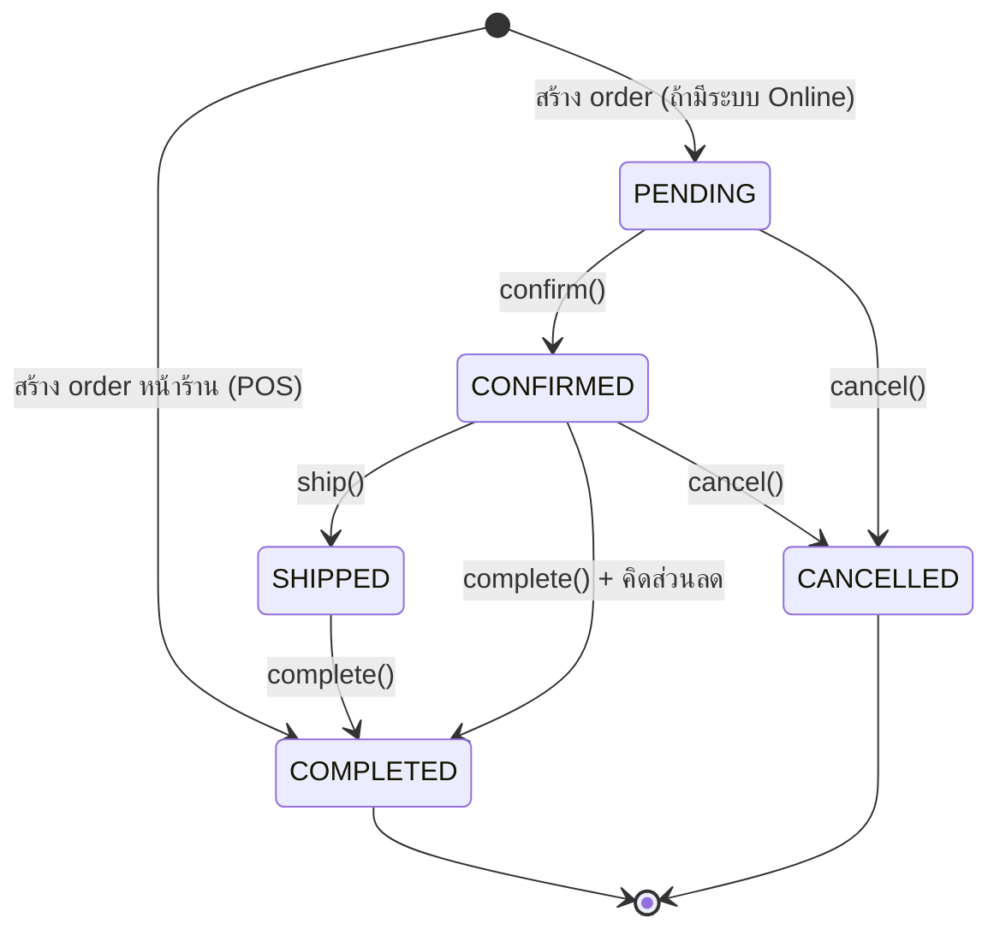
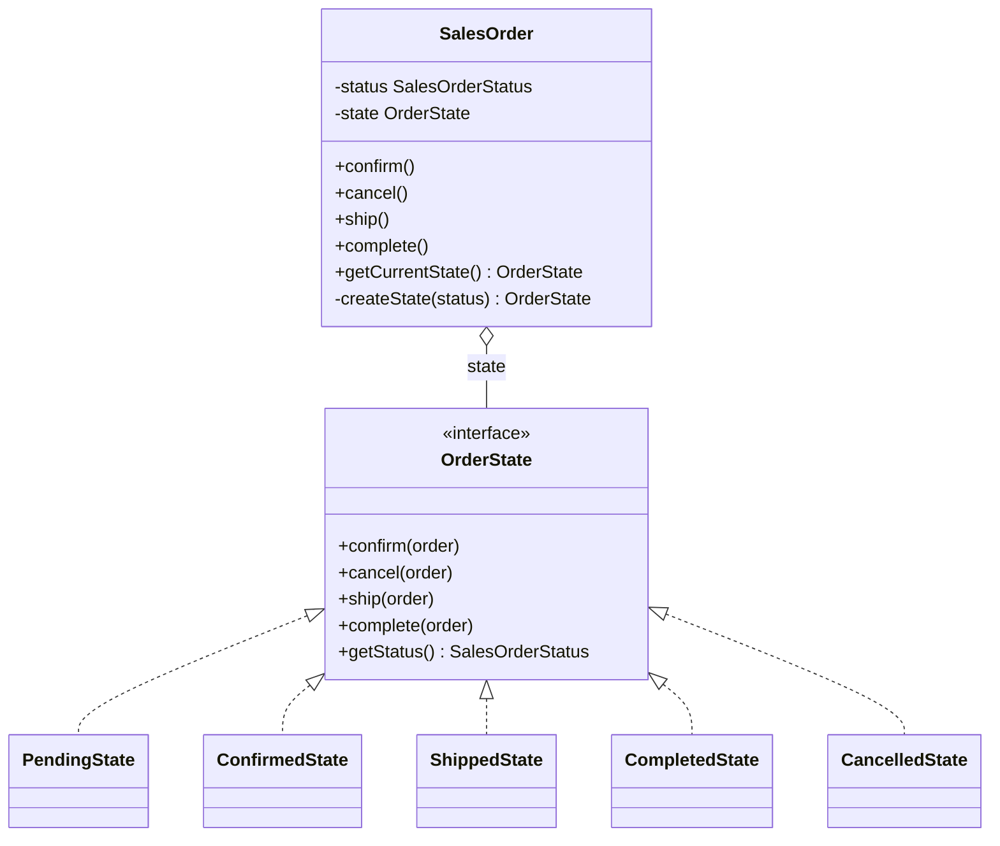
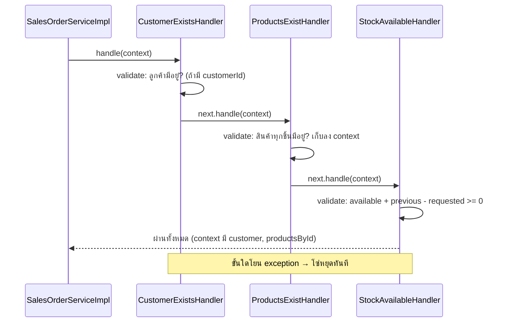
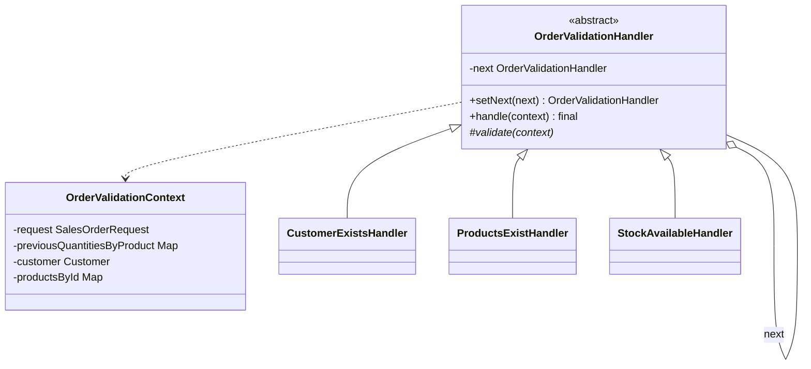
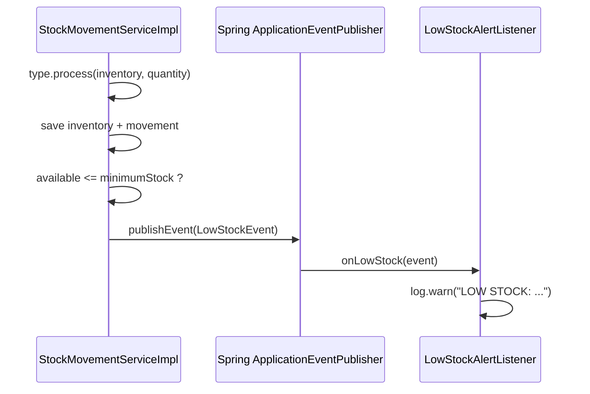

# Design Patterns

เอกสารนี้อธิบาย Design Pattern ที่ใช้ในโปรเจคตามโค้ดจริง ครบทุกส่วน: ปัญหาที่แก้ → โครงสร้างคลาส → ลำดับการทำงาน → จุดใช้งานในโค้ด → ข้อจำกัด

path ด้านล่างย่อ `code/backend/hardware-store/src/main/java/com/hardwarestore/` เป็น `…/`

## ตารางสรุป

| # | Pattern | หมวด | ปัญหาที่แก้ | คลาสหลัก |
|---|---------|------|-------------|-----------|
| 1 | **Strategy** | Behavioral | กฎส่วนลดหลายแบบ ไม่อยากเขียน `if/else` ปนกับการคำนวณยอด | `DiscountStrategy`, `NormalDiscount`, `BulkDiscount`, `MemberDiscount` |
| 2 | **State** | Behavioral | วงจรสถานะ Sales Order มีกฎการเปลี่ยนสถานะที่ต่างกันในแต่ละสถานะ | `OrderState`, `PendingState`, `ConfirmedState`, `ShippedState`, `CompletedState`, `CancelledState` |
| 3 | **Chain of Responsibility** | Behavioral | ตรวจสอบ order หลายขั้น (ลูกค้า → สินค้า → สต็อก) ต้องหยุดที่ขั้นแรกที่ผิด | `OrderValidationHandler` + 3 handler + `OrderValidationContext` |
| 4 | **Observer** (Spring Events) | Behavioral | แจ้งเตือนสต็อกต่ำโดยไม่ให้ service ผูกกับผู้รับแจ้งเตือน | `LowStockEvent`, `LowStockAlertListener` |
| 5 | **Polymorphic Enum** (รูปแบบ Strategy แบบ constant-specific) | Behavioral | การตัดสต็อกต่างกันตามประเภท IN/OUT/ADJUSTMENT | `StockMovementType` |
| 6 | **Mapper / DTO** | Structural / Enterprise | แยก Entity ออกจาก API contract | MapStruct `*Mapper` + `dto/request`, `dto/response` |
| 7 | **Dependency Injection** | Architectural | ลดการผูกคลาสเข้าด้วยกัน | `@RequiredArgsConstructor` ทุก Service/Controller |
| 8 | **Repository** | Enterprise | แยกการเข้าถึงข้อมูลออกจาก business logic | `*Repository extends JpaRepository` |
| 9 | **Soft Delete** | Persistence | ลบข้อมูลโดยไม่ทำลายประวัติอ้างอิง | `@SQLDelete` + `@SQLRestriction` บน Product/Customer/Supplier/Category |

---

## 1. Strategy Pattern — ส่วนลด

**ปัญหา:** ส่วนลดมีหลายกฎ (ลูกค้าทั่วไป, ซื้อจำนวนมาก, สมาชิก) ถ้าเขียนเป็น `if/else` ในการคำนวณยอดรวม โค้ดจะบวมและแก้ยาก

**โครงสร้าง**

**จุดใช้งานในโค้ด**

| ส่วน | ไฟล์ : บรรทัด |
|------|----------------|
| Interface | `…/strategy/DiscountStrategy.java` : 5-7 |
| Normal | `…/strategy/NormalDiscount.java` : 6-15 |
| Bulk (≥ 10 ชิ้น ลด 10%) | `…/strategy/BulkDiscount.java` : 6-23 (ค่าคงที่บรรทัด 8-9) |
| Member (ลด 10%) | `…/strategy/MemberDiscount.java` : 6-18 |
| เลือก strategy | `…/domain/entity/SalesOrder.java` : 164-179 (`resolveDiscountStrategy`) |
| ใช้ strategy คำนวณยอด | `SalesOrder.java` : 181-199 (`calculateTotal`) |
| เรียกคำนวณจริงตอนปิดงาน | `…/state/ConfirmedState.java` : 26-30 (`complete` เรียก `order.applyPricing()`) |

**กฎการเลือก strategy** (`SalesOrder.java` : 164-179):
1. ลูกค้าเป็นสมาชิก (`customer.isMember()`) → `MemberDiscount`
2. จำนวนชิ้นรวมทั้งใบ ≥ 10 → `BulkDiscount`
3. นอกนั้น → `NormalDiscount`

**ข้อควรรู้ (พฤติกรรมจริงของระบบ)**
- การสร้าง order สำหรับ POS หน้าร้าน, `SalesOrderMapper.updatePendingOrder` จะคัดลอกราคา `unitPrice` เท่านั้น จากนั้นจะส่งต่อให้ `order.applyPricing()` คำนวณราคาสุทธิและส่วนลดเบ็ดเสร็จในตัว Entity เอง และสถานะจะถูกเซ็ตเป็น `COMPLETED` ตั้งแต่แรก
- `BulkDiscount` ตรวจ `quantity >= 10` ต่อรายการสินค้า ส่วน `resolveDiscountStrategy` ตรวจจำนวนรวมทั้งใบ — เกณฑ์ทั้งสองจึงไม่ใช่ตัวเดียวกัน
- `resolveDiscountStrategy` ยัง `new` strategy เองและเป็น `if/else` — เพิ่มส่วนลดใหม่ต้องแก้เมธอดนี้ (ดู `solid-analysis.md` หัวข้อ OCP)

**Test:** `src/test/java/com/hardwarestore/strategy/DiscountStrategyTest.java`, `SalesOrderStrategyStateTest.java`

---

## 2. State Pattern — สถานะ Sales Order

**ปัญหา:** แต่ละสถานะของ order อนุญาตการกระทำไม่เหมือนกัน (เช่น ยกเลิกได้เฉพาะก่อนจัดส่ง) ถ้าใช้ `if (status == ...)` กระจายทั่วโค้ด จะดูแลยาก

**แผนภาพสถานะ**

**ตารางการเปลี่ยนสถานะ** (✔ = ทำได้, ✘ = โยน `InvalidSalesOrderStateException`)

| สถานะปัจจุบัน | confirm() | ship() | complete() | cancel() | ไฟล์ : บรรทัด |
|---------------|-----------|--------|------------|----------|----------------|
| PENDING | ✔ → CONFIRMED | ✘ | ✘ | ✔ → CANCELLED | `PendingState.java` : 7-34 |
| CONFIRMED | ✘ | ✔ → SHIPPED | ✔ → COMPLETED (เรียก `applyPricing`) | ✔ → CANCELLED | `ConfirmedState.java` : 7-36 |
| SHIPPED | ✘ | ✘ | ✔ → COMPLETED | ✘ | `ShippedState.java` : 7-33 |
| COMPLETED | ✘ | ✘ | ✘ | ✘ | `CompletedState.java` : 7-32 |
| CANCELLED | ✘ | ✘ | ✘ | ✘ | `CancelledState.java` : 7-32 |

(ทุกไฟล์อยู่ใน `…/state/`)

**โครงสร้างคลาส**

**จุดใช้งานในโค้ด**

| ส่วน | ไฟล์ : บรรทัด |
|------|----------------|
| Interface | `…/state/OrderState.java` : 6-16 |
| Context ถือ state | `SalesOrder.java` : 101-102 (`@Transient state`) |
| Delegate ไปยัง state | `SalesOrder.java` : 114-128 (`confirm/cancel/ship/complete`) |
| สร้าง state จาก enum | `SalesOrder.java` : 205-217 (`createState`) |
| Rebuild state หลังโหลดจาก DB | `SalesOrder.java` : 107-112 (`@PostLoad initializeState`) |
| ซิงก์ status ↔ state | `SalesOrder.java` : 137-147 (`setState`, `setStatus`) |
| ผู้เรียกใช้ | `SalesOrderServiceImpl.updateStatus` : 105-164 |

**ผลข้างเคียงทางธุรกิจ** (`SalesOrderServiceImpl`)
- สร้าง order (POS) → สถานะเป็น COMPLETED และตัดสต็อกทันที (`applyStockOut`)
- ยกเลิก order → คืนสต็อก (`applyStockReturnOnCancel`)
- แก้ order ที่ยัง PENDING (ถ้ารองรับ) → ปรับสต็อกเฉพาะส่วนต่าง (`applyPendingOrderStockAdjustment`)

**จุดเด่นของการออกแบบ (Fully Delegated)**
- `SalesOrderServiceImpl.updateStatus` ได้รับการ Refactor ให้ส่งต่อ (Delegate) ผ่านคำสั่ง `order.confirm()`, `order.ship()`, `order.complete()`, และ `order.cancel()` ไปยัง State Class โดยตรงทั้งหมด ทำให้ State Pattern ทำหน้าที่เป็น Single Source of Truth ในการควบคุมสถานะอย่างแท้จริงตามหลัก Open/Closed Principle (OCP)
- ลดความซ้ำซ้อนของ Logic และป้องกันบั๊กจากการข้ามสถานะที่ไม่ได้รับอนุญาต

**Test:** `src/test/java/com/hardwarestore/…/SalesOrderStateTest.java`, `SalesOrderStrategyStateTest.java`

---

## 3. Chain of Responsibility — ตรวจสอบ Sales Order

**ปัญหา:** ก่อนสร้าง/แก้ order ต้องตรวจหลายเรื่องตามลำดับ และหยุดทันทีเมื่อเจอข้อผิดพลาดแรก

**ลำดับในโซ่:** `CustomerExistsHandler` → `ProductsExistHandler` → `StockAvailableHandler`

| ส่วน | ไฟล์ : บรรทัด | หน้าที่ / Exception ที่โยน |
|------|----------------|-----------------------------|
| Base handler | `…/validation/OrderValidationHandler.java` : 7-26 | `setNext` คืน handler ถัดไปเพื่อต่อโซ่แบบ fluent; `handle` เป็น `final` (บรรทัด 17-22) |
| Context | `…/validation/OrderValidationContext.java` : 14-49 | พกข้อมูลระหว่าง handler |
| ตรวจลูกค้า | `…/validation/CustomerExistsHandler.java` : 16-25 | `customerId == null` → ข้าม (walk-in); ไม่พบ → `ResourceNotFoundException` (404) |
| ตรวจสินค้า | `…/validation/ProductsExistHandler.java` : 21-33 | ไม่พบ → `ResourceNotFoundException` (404); เก็บ `productsById` ลง context |
| ตรวจสต็อก | `…/validation/StockAvailableHandler.java` : 25-53 | ไม่พบ inventory → 404; `available + previous - requested < 0` → `IllegalArgumentException` (400) |
| ประกอบโซ่ | `SalesOrderServiceImpl.java` : 166-172 (`buildValidationChain`) | |
| เรียกใช้ตอนสร้าง | `SalesOrderServiceImpl.java` : 52-53 | |
| เรียกใช้ตอนแก้ | `SalesOrderServiceImpl.java` : 94-95 (ส่ง `previousQuantitiesByProduct` เพื่อบวกสต็อกเดิมคืนก่อนเทียบ) | |

**Test:** `src/test/java/com/hardwarestore/validation/OrderValidationChainTest.java` (5 test)

---

## 4. Observer Pattern — แจ้งเตือนสต็อกต่ำ (Spring Application Events)

**ปัญหา:** เมื่อสต็อกเหลือน้อย ต้องมีการแจ้งเตือน แต่ `StockMovementServiceImpl` ไม่ควรรู้ว่าใครรับแจ้งหรือแจ้งช่องทางไหน

| ส่วน | ไฟล์ : บรรทัด |
|------|----------------|
| Event (record) | `…/event/LowStockEvent.java` : 7-12 — `productId, sku, productName, availableQuantity, minimumStock` |
| Publisher | `…/service/impl/StockMovementServiceImpl.java` : 71-81 (`publishLowStockEventIfNeeded`, เรียกที่บรรทัด 66); inject `ApplicationEventPublisher` ที่บรรทัด 32 |
| Observer | `…/listener/LowStockAlertListener.java` : 13-23 (`@EventListener onLowStock`) |

**เงื่อนไข publish:** `product.minimumStock != null` และ `available <= minimumStock` โดย `available = quantity - reservedQuantity` (`InventoryStock.getAvailableQuantity`)

**การขยาย:** เพิ่ม listener ใหม่ (อีเมล, LINE, dashboard) เป็น `@Component` + `@EventListener` โดยไม่แตะ `StockMovementServiceImpl`

**Test:** `src/test/java/com/hardwarestore/service/impl/StockMovementLowStockEventTest.java`

---

## 5. Polymorphic Enum — ประเภทความเคลื่อนไหวสต็อก

**ปัญหา:** `IN`, `OUT`, `ADJUSTMENT` เปลี่ยนจำนวนสต็อกต่างกัน ถ้าใช้ `switch` ใน service จะต้องแก้ service ทุกครั้งที่เพิ่มประเภท

`…/domain/enums/StockMovementType.java` : 5-39 — enum ประกาศ `abstract void process(InventoryStock, int)` (บรรทัด 38) แล้วแต่ละค่า override:

| ค่า | พฤติกรรม | ข้อผิดพลาดที่โยน (`IllegalArgumentException` → 400) |
|-----|----------|------------------------------------------------------|
| `IN` (6-15) | `quantity += n` | เกินค่าสูงสุดของ `int` |
| `OUT` (16-25) | `quantity -= n` | `available < n` (สต็อกไม่พอ) |
| `ADJUSTMENT` (26-36) | ตั้ง `quantity = n` | `n < reservedQuantity` |

ผู้เรียก: `StockMovementServiceImpl.java` : 54 — `request.getMovementType().process(inventory, quantity);` (ไม่มี `if/switch`)

**ศูนย์กลางการเปลี่ยนสต็อก:** ทุกเส้นทางที่เปลี่ยนสต็อกเรียก `StockMovementService.create` ได้แก่ ขาย (`SalesOrderServiceImpl`), รับของ (`PurchaseOrderServiceImpl.receive` : 98-106), ปรับสต็อก (`InventoryStockServiceImpl.adjustStock` : 42-48) — จึงมี audit trail ใน `stock_movements` ครบ

---

## 6. Mapper / DTO Pattern

**ปัญหา:** ไม่ควรส่ง Entity ออก API ตรงๆ (lazy loading, เปิดเผยฟิลด์ภายใน เช่น `costPrice`)

- Mapper ใช้ **MapStruct** (`@Mapper(componentModel = "spring")`) อยู่ที่ `…/mapper/` (8 ตัว)
- `SalesOrderMapper` และ `PurchaseOrderMapper` เป็น `abstract class` เพราะมี logic เพิ่ม (คำนวณ subtotal/total, `updatePendingOrder`) ส่วนตัวอื่นเป็น `interface`
- ตัวอย่างการแยก DTO ตามสิทธิ์: `ProductMapper.java` : 23-29 มี `toResponse` (ไม่มี `costPrice`) กับ `toAdminResponse` (มี `costPrice`)
- ราคาต่อหน่วยของ Sales Order มาจาก `product.getPrice()` ฝั่งเซิร์ฟเวอร์ (`SalesOrderMapper.java` : 49) ไม่เชื่อค่า `unitPrice` จาก client (ฟิลด์ใน `SalesOrderItemRequest` ถูกทำเครื่องหมาย `@Deprecated` บรรทัด 22-24)
- Request DTO ตรวจความถูกต้องด้วย Jakarta Validation (`@NotBlank`, `@Positive`, `@Size`, `@Email`, `@Pattern`) และ Controller เปิดด้วย `@Valid`

---

## 7. Dependency Injection

- ทุก `@Service` / `@RestController` ใช้ `@RequiredArgsConstructor` + field `final` (Constructor Injection) เช่น `SalesOrderServiceImpl.java` : 38-47
- Controller พึ่ง Service **interface**, Service พึ่ง Repository **interface**
- ข้อยกเว้น: handler ใน Chain ถูกสร้างด้วย `new` ใน `buildValidationChain()` และส่ง repository เข้า constructor เอง

## 8. Repository Pattern

- `…/repository/` มี 9 interface ที่ `extends JpaRepository<Entity, Long>` พร้อม query method ตามชื่อ เช่น `existsBySkuIgnoreCase`, `findByProductId`, `findByNameContainingIgnoreCaseAndCategoryId`
- Service ไม่เขียน SQL เอง

## 9. Soft Delete

- `Product` (`Product.java` : 12-13), `Customer` (27-28), `Supplier` (11-12), `Category` (11-12) ใช้ `@SQLDelete(sql = "UPDATE … SET is_active = false …")` + `@SQLRestriction("is_active = true")`
- `repository.delete(...)` จึงกลายเป็นการตั้ง `is_active = false` และ query ปกติจะไม่เห็นแถวที่ถูก "ลบ" — ใบสั่งซื้อ/ขายเดิมยังอ้างอิงสินค้าได้
- `SalesOrder`, `PurchaseOrder`, `StockMovement` **ไม่มี** delete (ไม่มีเมธอด `delete` ใน service/controller)

---

## สรุปการใช้งาน Pattern ต่อ Use Case

| Use Case | Pattern ที่ทำงานร่วมกัน |
|----------|--------------------------|
| สร้าง Sales Order | DTO/Mapper → **Chain** (ตรวจ) → Mapper (คำนวณราคา) → Repository → **Polymorphic Enum** (ตัดสต็อก) → **Observer** (ถ้าสต็อกต่ำ) |
| ปิดงานขาย (complete) | **State** (`ConfirmedState.complete`) → **Strategy** (คิดส่วนลด) |
| ยกเลิก Order | **State** (`cancel`) → **Polymorphic Enum** (คืนสต็อก IN) |
| รับของเข้า (receive PO) | **Polymorphic Enum** (IN) → **Observer** |
| ลบสินค้า | **Soft Delete** |

