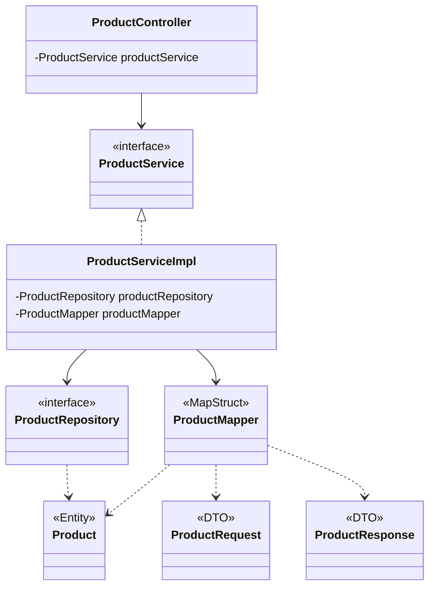
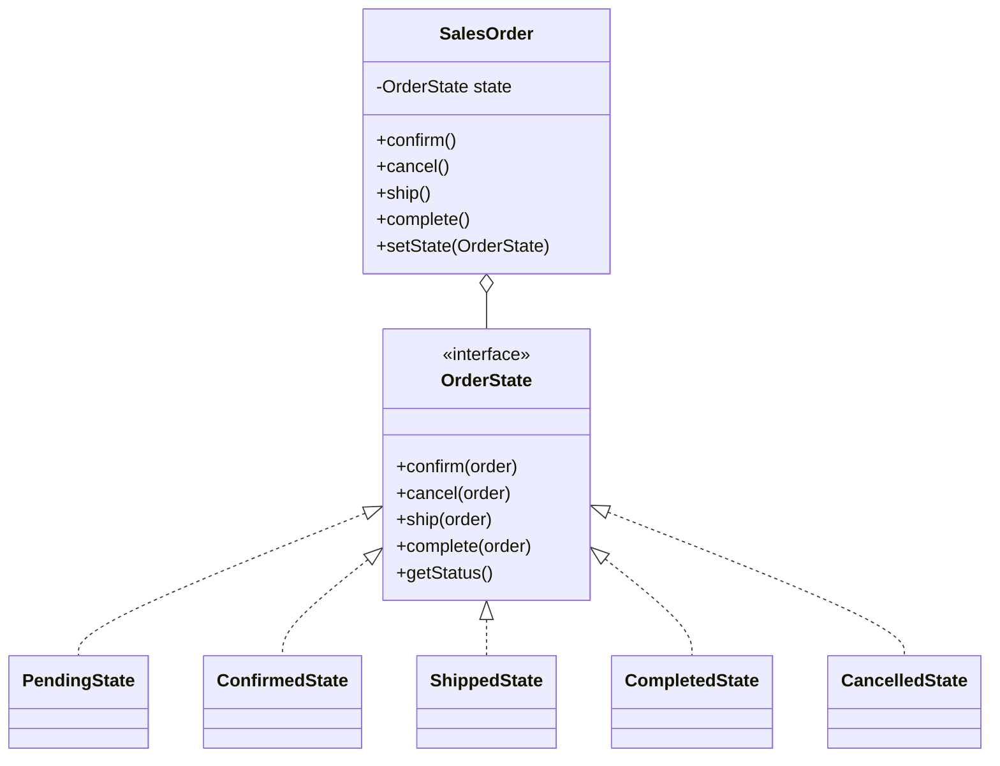
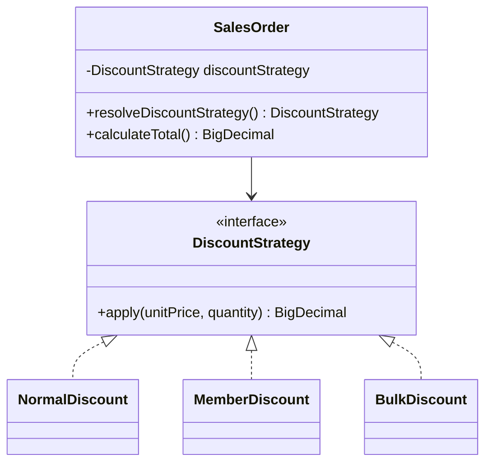
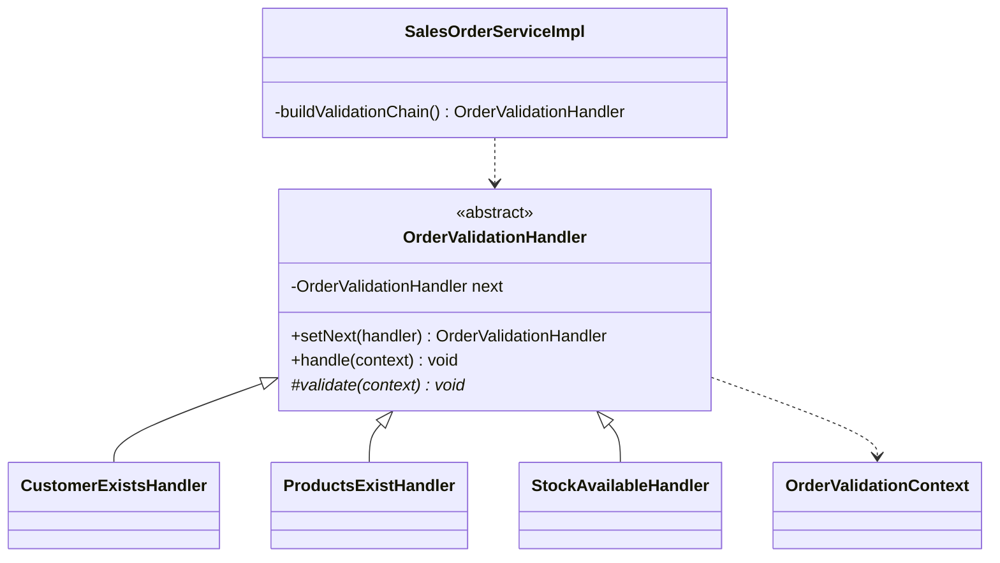
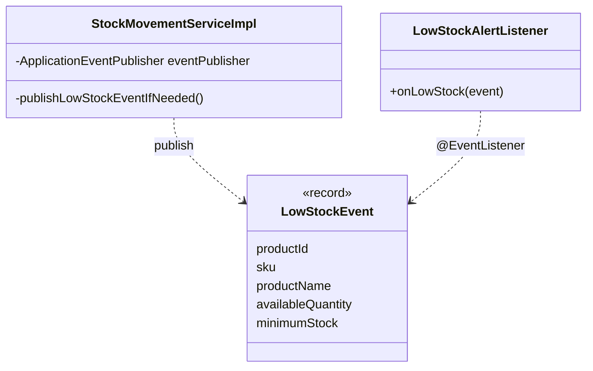

# Design Patterns — Hardware Store Inventory Management System

path ของไฟล์ทั้งหมดอ้างอิงจาก `code/backend/hardware-store/src/main/java/com/hardwarestore/`

## 1. Enterprise / Architectural Patterns

| Pattern | ปัญหาที่แก้ | ไฟล์/คลาสที่ใช้ | Class Diagram |
|---|---|---|---|
| Layered Architecture | แยกหน้าที่ของโค้ดเป็นชั้น เพื่อให้แก้ชั้นหนึ่งโดยไม่กระทบชั้นอื่น | `controller/api/*Controller`, `service/*Service` + `service/impl/*ServiceImpl`, `repository/*Repository`, `domain/entity/*` เช่น `ProductController.java:19` → `ProductService` → `ProductRepository.java:8` | [Enterprise class diagram](diagrams/03a-class-diagram-enterprise-patterns.png) |
| MVC | แยกการรับ request, ข้อมูล และหน้าจอออกจากกัน | Controller = `controller/api/*Controller.java`; Model = `domain/entity/*` + `dto/*`; View = React ใน `code/frontend/src` | [Enterprise class diagram](diagrams/03a-class-diagram-enterprise-patterns.png) |
| Repository | ซ่อนรายละเอียดการเข้าถึงฐานข้อมูลไว้หลัง interface | `repository/*Repository.java` (extends `JpaRepository`) เช่น `ProductRepository.java:8-17` | [Enterprise class diagram](diagrams/03a-class-diagram-enterprise-patterns.png) |
| Service Layer | รวม business logic และ transaction ไว้ที่เดียว ไม่ปนใน Controller | `service/impl/*ServiceImpl.java` เช่น `SalesOrderServiceImpl.java:34-57` (`@Service`, `@Transactional`) | [Enterprise class diagram](diagrams/03a-class-diagram-enterprise-patterns.png) |
| DTO + Mapper | ไม่เปิด Entity ออก API โดยตรง และคุมรูปแบบ request/response | `dto/request/*`, `dto/response/*`, `mapper/*Mapper.java` (MapStruct) เช่น `SalesOrderMapper.java:19-69` | [Enterprise class diagram](diagrams/03a-class-diagram-enterprise-patterns.png) |
| Dependency Injection | ลดการผูกคลาสเข้าด้วยกัน และ mock ตอนเทสได้ | Constructor Injection ผ่าน `@RequiredArgsConstructor` + `final` field เช่น `SalesOrderServiceImpl.java:34-43` | [Enterprise class diagram](diagrams/03a-class-diagram-enterprise-patterns.png) |

### 1.1 โครงสร้างชั้นและการพึ่งพา

## 2. GoF Patterns — กลุ่ม Behavioral (4 แบบ)

| Pattern | ปัญหาที่แก้ | ไฟล์/คลาสที่ใช้ | Class Diagram |
|---|---|---|---|
| State | ใบสั่งขายมี 5 สถานะ แต่ละสถานะอนุญาตให้ทำต่างกัน ถ้าใช้ if-else ใน Service จะยาวและแก้ยาก | `state/OrderState.java:6-16`, `PendingState`, `ConfirmedState`, `ShippedState`, `CompletedState`, `CancelledState`; Context = `domain/entity/SalesOrder.java:101-147`; ผู้เรียก = `SalesOrderServiceImpl.java:110-121` | [State class diagram](diagrams/03b-class-diagram-gof-patterns.png) |
| Strategy | วิธีคิดราคาต่างกันตามลูกค้า/จำนวน ต้องสลับได้โดยไม่ใช้ if-else ตอนคำนวณ | `strategy/DiscountStrategy.java:5-7`, `NormalDiscount`, `MemberDiscount`, `BulkDiscount`; เลือก strategy ที่ `SalesOrder.java:164-179`; ใช้คำนวณที่ `SalesOrder.java:181-201` | [Strategy class diagram](diagrams/03b-class-diagram-gof-patterns.png) |
| Chain of Responsibility | ตรวจใบสั่งขายหลายขั้น (ลูกค้า → สินค้า → สต็อก) โดยแต่ละขั้นเป็นคลาสเดียว และหยุดทันทีเมื่อขั้นใดไม่ผ่าน | `validation/OrderValidationHandler.java:7-26`, `CustomerExistsHandler.java:7`, `ProductsExistHandler.java:12`, `StockAvailableHandler.java:16-53`, `OrderValidationContext.java:14`; ประกอบสายที่ `SalesOrderServiceImpl.java:131-136` และเรียกใช้ที่ `:48-49`, `:90-91` | [Chain class diagram](diagrams/03b-class-diagram-gof-patterns.png) |
| Observer | เมื่อสต็อกต่ำต้องแจ้งเตือน โดยไม่ให้ Service ต้องรู้ว่าใครรับแจ้ง | `event/LowStockEvent.java:7-12`; ผู้ส่ง = `StockMovementServiceImpl.java:34,72-74,78-88` (`ApplicationEventPublisher`); ผู้รับ = `listener/LowStockAlertListener.java:13-22` (`@EventListener`) | [Observer class diagram](diagrams/03b-class-diagram-gof-patterns.png) |

### 2.1 State

ถ้าทำรายการที่สถานะนั้นไม่อนุญาต State จะโยน `InvalidSalesOrderStateException` ซึ่ง `GlobalExceptionHandler` แปลงเป็น HTTP 409

### 2.2 Strategy

กติกา (`SalesOrder.java:164-179`): ลูกค้าสมาชิก → `MemberDiscount` (ลด 10%); ไม่ใช่สมาชิกแต่ซื้อรวม ≥ 10 ชิ้น → `BulkDiscount` (ลด 10%); นอกนั้น → `NormalDiscount` (ราคาเต็ม)

### 2.3 Chain of Responsibility

ลำดับในสาย: `CustomerExistsHandler` → `ProductsExistHandler` → `StockAvailableHandler` (`SalesOrderServiceImpl.java:131-135`)

### 2.4 Observer

